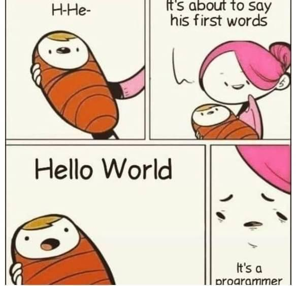
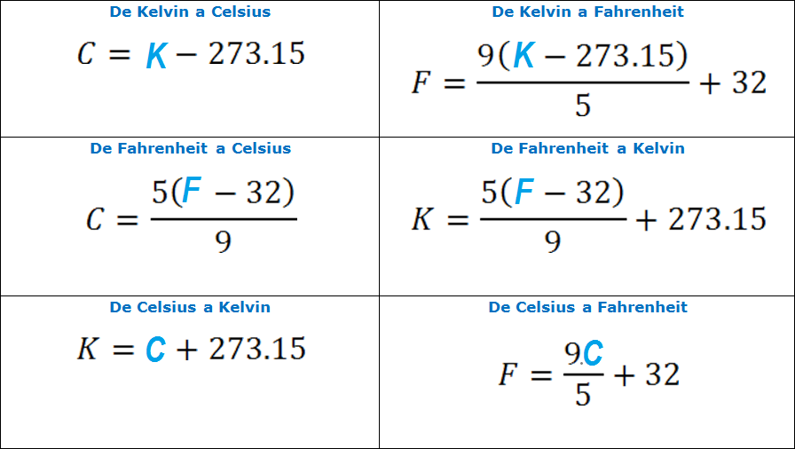

```{r setup, include = FALSE}
# Setup chunk
# Paquetes a usar
#options(htmltools.dir.version = FALSE) cambia la forma de incluir código, los colores

library(knitr)
library(tidyverse)
library(xaringanExtra)
library(icons)
library(fontawesome)
library(emo)

# set default options
opts_chunk$set(collapse = TRUE,
               dpi = 300,
               warning = FALSE,
               error = FALSE,
               comment = "#")

top_icon = function(x) {
  icons::icon_style(
    icons::fontawesome(x),
    position = "fixed", top = 10, right = 10
  )
}

knit_engines$set("yaml", "markdown")

# Con la tecla "O" permite ver todas las diapositivas
xaringanExtra::use_tile_view()
# Agrega el boton de copiar los códigos de los chunks
xaringanExtra::use_clipboard()

# Crea paneles impresionantes 
xaringanExtra::use_panelset()

# Para compartir e incrustar en otro sitio web
xaringanExtra::use_share_again()
xaringanExtra::style_share_again(
  share_buttons = c("twitter", "linkedin")
)

# Funcionalidades de los chunks, pone un triangulito junto a la línea que se señala
xaringanExtra::use_extra_styles(
  hover_code_line = TRUE,         #<<
  mute_unhighlighted_code = TRUE  #<<
)

# Agregar web cam

xaringanExtra::use_webcam()
```

```{r xaringan-editable, echo=FALSE}
# Para tener opciones para hacer editable algun chunk
xaringanExtra::use_editable(expires = 1)
# Para hacer que aparezca el lápiz y goma
xaringanExtra::use_scribble()
```

```{r xaringan-themer, include=FALSE, warning=FALSE}
# Establecer colores para el tema
library(xaringanthemer)
#style_mono_light(base_color = "#562457")
```

class: title-slide, middle, center
background-image: url(imagenes/liigh_unam_logo.png) 
background-position: 10% 50%
background-size: 15%


.center-column[
# `r rmarkdown::metadata$title`
### `r rmarkdown::metadata$subtitle`

####`r rmarkdown::metadata$author` 
#### `r rmarkdown::metadata$date`
]

.left[.footnote[R-Ladies Theme[R-Ladies Theme](https://www.apreshill.com/project/rladies-xaringan/)]]

---

## Instalar y cargar paquetes necesarios

Instalar el paquete `assertthat`

```{r instalacion de paquetes, eval = FALSE}
install.packages("assertthat") ## Mensajes de error
```

Cargar el paquete

```{r cargar paquetes, message=FALSE}
library(assertthat) ## Mensajes de error
library(dplyr) # Manipulacion de datos
```

---

class: center, middle

`r fontawesome::fa("code", height = "3em")`
# El ABC de las funciones

---
## ¿QUÉ ES UNA FUNCIÓN?

Las funciones reúnen una secuencia de operaciones como un todo, almacenandola para su uso continuo. Las funciones proveen:

- un **NOMBRE** que podemos recordar y usar para invocarla

- una **solución para la necesidad** de recordar operaciones individuales

- un conjunto definido de **inputs y outputs** esperados

- una **mayor conexión** con el ambiente de programación

Como el componente básico de la mayoría de los lenguajes de programación, las funciones definidas por el usuario constituyen la “programación” de cualquier abstracción que puedas hacer. 

Si has escrito una función, eres ya todo un programador.


.left[.footnote[.black[
[Sofware Carpentry](https://swcarpentry.github.io/r-novice-gapminder-es/10-functions.html)
]]]

---

.center[

]

---

## Tips para generar una función

.center[

]

.left[.footnote[.black[
[R- bloggers, Writing functions in R](https://www.r-bloggers.com/2022/09/writing-functions-in-r/)
]]]

---

## Nuestro primer código

> **Problema:** Realizar un algoritmo que solicite al usuario *dos numeros enteros*, realice su suma y la imprima en pantalla.

```{r Primer codigo, eval=FALSE}
# ---Algoritmo(Sumar)---
# 1) Solicitar al usuario los datos de entrada (variable a y b).
# --INICIO--
a <- readline("Digite el primer numero: ")
b <- readline("Digite el segundo numero: ")

# Convertir la entrada en numeros enteros
a <- as.integer(a)
b <- as.integer(b)

# 2) Realizar la suma de los datos de entrada.
c <- a + b 
 
# 3) Mostrar el resultado.
print(c)
# --FIN_INICIO--
# --- Fin_de_Algoritmo(Sumar) ---
```

---

## Funciones definidas por el usuario 

```{r Funcion - my_sum v1}
my_sum <- function(a, b) {
  c <- a + b
  return(c)
}
```

- `my_sum` es el nombre de la función que estamos definiendo
- `a,b` son argumentos
- `c <- a + b` son las operaicones

---

## Ejercicio: Nuestra primera función 

> **Problema:** Realizar un algoritmo que solicite al usuario *dos numeros enteros*, realice su suma y la imprima en pantalla.

```{r Funcion - my_sum v2}
my_sum <- function(a, b) {
# Convertir la entrada en numeros enteros
  a <- as.integer(a)
  b <- as.integer(b)
# Realizar la suma de los datos de entrada
  c <- a + b
# Mostrar el resultado
  return(c)
}
```

--
#### Verificación / Realizar pruebas

```{r Verfiicar my_sum}
my_sum(3,4)
```

---

## Conversiones de temperatura

.center[

]

---

## Conversión de Fahrenheit a Kelvin

```{r Funcion - fahr_to_kelvin}
fahr_to_kelvin <- function(temp) {
  kelvin <- ((temp - 32) * (5 / 9)) + 273.15
  return(kelvin)
}
```

.left[.footnote[.black[
[Sofware Carpentry, Funciones](https://swcarpentry.github.io/r-novice-gapminder-es/10-functions.html)
]]]

--
#### Verificación / Realizar pruebas

```{r Verfiicar fahr_to_kelvin}
fahr_to_kelvin(32) # Punto de congelación del agua

fahr_to_kelvin(212) # Punto de ebullición del agua
```

---

## Conversión de Kelvin a Celsius

```{r Funcion - kelvin_to_celsius}
kelvin_to_celsius <- function(temp) {
  celsius <- temp - 273.15
  return(celsius)
}
```

.left[.footnote[.black[
[Sofware Carpentry, Funciones](https://swcarpentry.github.io/r-novice-gapminder-es/10-functions.html)
]]]

--
#### Verificación / Realizar pruebas

```{r Verfiicar kelvin_to_celsius}
kelvin_to_celsius(300) 

kelvin_to_celsius(400) 
```

---

class: center, middle

`r fontawesome::fa("code", height = "3em")`
# Estructuras de control

---

## Estructuras de control

Las estructuras de control nos permiten controlar la manera en que se ejecuta nuestro código.

Las estructuras de control establecen condicionales en nuestros código. Por ejemplo, qué condiciones deben cumplirse para realizar una operación o qué debe ocurrir para ejecutar una función.

Esto es de gran utilidad para determinar la lógica y el orden en que ocurren las operaciones, en especial al definir funciones.

.left[.footnote[.black[
[R para principiantes, cap 9](https://bookdown.org/jboscomendoza/r-principiantes4/estructuras-de-control.html)
]]]

--

#### Las estructuras de control más usadas

| Estructura de control        | Descripción                                |
|------------------------------|--------------------------------------------|
| `if, else`                   | Si, de otro modo                           | 
| `for`                        | Para cada uno en                           | 
| `while`                      | Mientras                                   |
| `break`                      | Interrupción                               |
| `next`                       | Siguiente                                  | 
| `case_when`                  | Conducional con diversas salidas           | 

---
## `if, else`

`if` (si) es usado cuando deseamos que una operación se ejecute únicamente cuando una condición se cumple.

`else` (de otro modo) es usado para indicarle a R qué hacer en caso de la condición de un if no se cumpla.

Ejemplos de pseudocódigo:

```{r pseudocode ifelse v1, eval =FALSE}
Start function
Input information
Logical test: if TRUE
  (what to do if TRUE)
else
  (what to do if FALSE)
End function
```

---
## `if, else`

- **SI** esta condición es cierta, **ENTONCES** haz estas operaciones.

```{r pseudocode ifelse v2, eval=FALSE}
IF you are happy
   THEN smile
ENDIF
```

--

Ejemplo sencillo:

```{r ejemplo ifelse}
if(4 > 3) {
  "Verdadero"
}
```

---
## `if, else`

- **SI** esta condición es es cierta, **ENTONCES** haz estas operaciones, **DE OTRO MODO** haz estas otras operaciones

```{r pseudocode ifelse v3, eval=FALSE}
IF you are happy THEN
    smile
ELSE
    frown
ENDIF
```

--

Si se cumple la condición y se muestra "Verdadero"

```{r}
if(4 > 3) {
  "Verdadero"
} else {
  "Falso"
}
```

---

.center[

]

---
## `for` (for loop)

Su estructura es la siguiente:

```{r Estructura For, eval=FALSE}
for(elemento in objeto) {
  operacion_con_elemento
}
```

Con lo anterior le decimos a R:

- **PARA** cada elemento **EN un objeto** (contador), haz la siguiente operación.

---
## `for` (for loop)

Vamos a obtener el cuadrado de cada uno de los elementos en un vector numérico del 1 al 6, que representa las caras de un dado.

```{r ejemplo dado}
dado <- 1:6

for(cara in dado) {
  print(cara ^ 2)
}
```

Usar print() sólo mostrará los resultados de las operaciones en la consola, no los asignará a un objeto.

---

## Almacenar resultados del `for` (for loop)

```{r ejemplo dado v2}
dado <- 1:6
mi_vector <- NULL # variable de almacen

for(cara in dado) {
  mi_vector[cara] <- cara ^ 2
}

mi_vector
```

---

## `while`

Este es un tipo de bucle que ocurre **mientras** una condición es verdadera (TRUE). La operación se realiza hasta que se se llega a cumplir un criterio previamente establecido.

El modelo de while es:

```{r Estructura While, eval=FALSE}
while(condicion) {
  operaciones
}
```

Con esto le decimos a R:

- **MIENTRAS** esta condición sea **VERDADERA**, haz estas operaciones.

La condición generalmente es expresada como el resultado de una o varias operaciones de comparación, pero también puede ser el resultado de una función.

---

## `while`

- Primero, tomará un número al azar del 1 al 10, y lo sumará a valor. 

- Segundo, le sumará 1 a conteo cada que esto ocurra, de esta manera sabremos cuántas iteraciones ocurrieron para llegar a un valor que no sea menor a 50.

```{r}
conteo <-  0
valor <- 0

while(valor < 50) {
  valor <- valor + sample(x = 1:10, size = 1)
  conteo <- conteo + 1
}

valor
conteo
```

---

## Cuando la condición no es TRUE, no pasa nada

```{r}
conteo <- 0

while("dado" == "ficha") {
  conteo <- conteo + 1
}

conteo
```

---

## `break y next`

`break` y `next` son palabras reservadas en R, *no podemos asignarles nuevos valores* y realizan una operación específica cuando aparecen en nuestro código.

`break` nos permite **interrumpir** un bucle, mientras que next nos deja avanzar a la **siguiente** iteración del bucle, “saltándose” la actual. Ambas funcionan para `for` y `while`.

---

## Usando `break`

Para interrumpir un bucle con `break`, **necesitamos que se cumpla una condición**. Cuando esto ocurre, el bucle se detiene, aunque existan elementos a los cuales aún podría aplicarse.

Interrumpimos un for cuando `i` es igual a 3, aunque aún queden 7 elementos en el objeto.

```{r ejemplo break}
for(i in 1:10) {
  if(i == 3) {
    break
  }
  print(i)
}
```

---
## Usando `break` y `while`

```{r break y while }
numero <- 20

while(numero > 5) {
  if(numero == 15) {
    break
  }
  numero <- numero - 1
}

numero
```

---

## Usando `next`

Por su parte, usamos next para “saltarnos” una iteración en un bucle. Cuando la condición se cumple, esa iteración es omitida.

```{r}
for(i in 1:4) {
  if(i == 3) {
    next
  }
  print(i)
}
```

---

## `case_when()` esquema general

```{r esquema general case, eval=FALSE}
INPUT color
CASE color of
    red: PRINT "red"
    green: PRINT "green"
    blue: PRINT "blue"
OTHERS
    PRINT "Please enter a value color"
ENDCASE
```

---

## Ejemplo: `case_when()` 

Es del paquete `dplyr`.

```{r ejemplo case}
x <- 1:20
case_when(
  x %% 35 == 0 ~ "fizz buzz",
  x %% 5 == 0 ~ "fizz",
  x %% 7 == 0 ~ "buzz",
  .default = as.character(x)
)
```

---

## Ejemplo en dataframe: `case_when()`

`starwars` es un dataset proveniente del paquete `dplyr`.

```{r ejemplo dplyr}
starwars %>%
  select(name:mass, gender, species) %>%
  mutate(
    type = case_when(
      height > 200 | mass > 200 ~ "large",
      species == "Droid" ~ "robot",
      .default = "other"
    )
  )
```


---

class: center, middle

`r fontawesome::fa("code", height = "3em")`
# Las funciones de la familia apply

---

## Las funciones de la familia apply

La familia apply esta formada por las siguientes funciones:

- apply()
- eapply()
- lapply()
- mapply()
- rapply()
- sapply()
- tapply()
- vapply()

Todas las funciones de esta familia tienen una característica en común: **reciben como argumentos a un objeto y al menos una función**.

---

## `apply()`

Generar una matriz

```{r}
matriz <- matrix(1:14, nrow = 4) 
```
Aplicado a los filas

```{r}
apply(matriz, 1, mean)
```

Aplicado a las columnas

```{r}
apply(matriz, 2, mean)
```

.left[.footnote[.black[
[R para principiantes, cap 10](https://bookdown.org/jboscomendoza/r-principiantes4/la-familia-apply.html)
]]]


---

class: center, middle

`r fontawesome::fa("code", height = "3em")`
# Programación defensiva

---

## Programación defensiva

Es importante garantizar que las funciones **solo funcionen para lo que quieres**. Este concepto se llama *programación defensiva*. Nos lleva a probar las **condiciones necesarias** para que funcione y **arrojar un error** si algo está mal.

Vamos a usar las funciones `stop()` y `stopifnot()` para detener el código cuando hay un error.

Para más información sobre `stopifnot()` puedes leer su [manual](https://www.rdocumentation.org/packages/base/versions/3.6.2/topics/stopifnot).  


.left[.footnote[.black[
[Software Carpentry, Programación defensiva](https://swcarpentry.github.io/r-novice-gapminder-es/10-functions.html)
]]]

---

## Usando `stop()` con `if()`

El argumento *temp* debe ser un valor **numeric**. Para crear un *error*, podemos usar la función `stop()`. Por ejemplo, dado que el argumento *temp* debe ser un **vector numeric**, podríamos probarlo con un condicional `if()` y devolver un *error* si la condición no se cumple. Podríamos agregar esto a nuestra función de la siguiente manera:

```{r funcion - fahr_to_kelvin con notas}
fahr_to_kelvin <- function(temp) {
  if (!is.numeric(temp)) {
    stop("temp must be a numeric vector.") # condiciones
  }
  kelvin <- ((temp - 32) * (5 / 9)) + 273.15
  return(kelvin)
}
```

--
#### Verificación / Realizar pruebas

```{r Verfiicar fahr_to_kelvin notas}
fahr_to_kelvin(temp = 32)
```
```{r Verfiicar fahr_to_kelvin notas v2, eval=FALSE}
fahr_to_kelvin(temp = "A")
# Error in fahr_to_kelvin(temp = "A") : temp must be a numeric vector
```

---

## Probando condiciones con `stopifnot()`
  
```{r}
fahr_to_kelvin <- function(temp) {
  stopifnot(is.numeric(temp)) # condiciones
  kelvin <- ((temp - 32) * (5 / 9)) + 273.15
  return(kelvin)
}
```

--
#### Verificación / Realizar pruebas

```{r Verfiicar fahr_to_kelvin notas v3}
fahr_to_kelvin(temp = 32)
```
```{r Verfiicar fahr_to_kelvin notas v4, eval=FALSE}
fahr_to_kelvin(temp = as.factor(32))
# Error in fahr_to_kelvin(temp = as.factor(32)) : is.numeric(temp) is not TRUE
```

---
## Usando `warning()` y  `message()` con `if()`

```{r funcion - squareX}
squareX <- function(x) {
    if (is.character(x)) {
        warning("Converting x to numeric")
        x <- as.numeric(x)
    } else {
        # the type checking done here is of course very incomplete
        message("x appears to be numeric")
    }
    x ^ 2 
}

```

--
#### Verificación / Realizar pruebas

```{r Verfiicar squareX v1}
squareX("4")
```

```{r Verfiicar squareX v2}
squareX(4)
```

---

## Usando el paquete `assertthat`

El paquete `assertthat` realiza lo mismo que `stopifnot`.

Ejemplos:

```{r eval=FALSE}
x <- 1:10
stopifnot(is.character(x))
# Error: is.character(x) is not TRUE
assert_that(is.character(x))
# Error: x is not a character vector
assert_that(length(x) == 5)
# Error: length(x) not equal to 5
assert_that(is.numeric(x))
# [1] TRUE
```

Para más información sobre `assertthat` puedes leer su [manual](https://www.r-project.org/nosvn/pandoc/assertthat.html#:~:text=assertthat%20provides%20a%20drop%20in,while%20producing%20useful%20error%20messages.).  

---
## Usando el paquete `assertthat`

```{r}
foo_message <- function(x) {
    assertthat::assert_that(x == 1, msg = "x must always be 1")
    "yay"
} 
# verficacion
foo_message(1)
```

---

## Guardar funciones, Opcion A

Cargando la función almacenada en un RData

```{r funcion - squareX guardar}
squareX <- function(x) {
    if (is.character(x)) {
        warning("Converting x to numeric")
        x <- as.numeric(x)
    } else {
        # the type checking done here is of course very incomplete
        message("x appears to be numeric")
    }
    x ^ 2 
}

# Guardar
save(squareX, file="./squareX.Rdata")
rm(squareX) # eliminar funcion
```

Cargar en el ambiente de RStudio

```{r}
load("./squareX.Rdata")
```

---

## Guardar funciones, Opcion B

Si has estado escribiendo estas funciones en un script de R aparte (¡una buena idea!), puedes cargar las funciones en nuestra sesión de R usando la función `source()`:


```{r, eval=FALSE}
source("squareX_function.R")
```

---

class: center, middle

`r fontawesome::fa("code", height = "3em")`
# Ejercicios de Funciones en R
## Trabajo en equipo

20 min para terminar todos los ejercicios por equipo

---

## Ejercicios

1) Crear una función que realice la conversión de Fahrenheit a Celsius y colocale el nombre `fahr_a_celsius()`.

2) A partir del ejercicio anterior, emplea la programación defensiva para asegurar que nuestra función `fahr_a_celsius()` arroja inmediatamente un error si el argumento `temp` se especifica inadecuadamente. Usa la función `stopifnot()`

3) Crear una función evalúe las calificaciones de un alumno (c(6,7,7,9,8)) y me arroje si el alumno esta reprobado o aprobado.

Una vez que terminen realicen los ejercicios de: 

- Ejercicios de [Manipulación de datos, parte 1](https://eveliacoss.github.io/ViernesBioinfo/Clase4_13Oct2023/D4_ManipulacionDeDatos.html#29), usar el ultimo dataset obtenido del paso 6. Total: 3 ejercicios

- Ejercicios de [Manipulación de datos, parte 2](https://eveliacoss.github.io/ViernesBioinfo/Clase4_13Oct2023/D4_ManipulacionDeDatos.html#32), usar el ultimo dataset obtenido del paso 10. Total: 4 ejercicios.

---

.center[

]

---

## Referencias

- [R para principiantes, Cap 8, Cap 9, Cap 10](https://bookdown.org/jboscomendoza/r-principiantes4/)

- [Software Carpentry, funciones](https://swcarpentry-ja.github.io/r-novice-gapminder/es/_episodes/10-functions/index.html)

- [Software Carpentry, funciones de apply](https://resbaz.github.io/r-intermediate-gapminder/17-apply.html)

- [Software Carpentry, Intermediate programming with R](https://jdblischak.github.io/r-intermediate-altmetrics/23-stopifnot.html)

- [Funciones apply, lapply, sapply, tapply, mapply y vapply en R](https://www.diegocalvo.es/funciones-apply-lapply-sapply-tapply-mapply-vapply-en-r/)

- [Error handling and assertions in R](https://hohenfeld.is/posts/error-handling-and-assertions-in-r/)

- [assertthat](https://www.r-project.org/nosvn/pandoc/assertthat.html#:~:text=assertthat%20provides%20a%20drop%20in,while%20producing%20useful%20error%20messages.)

- [Hands-On programming with R](https://rstudio-education.github.io/hopr/loops.html)

- [How to write Pseudocode: A beginner’s guide](https://medium.com/@ngunyimacharia/how-to-write-pseudocode-a-beginners-guide-29956242698)
